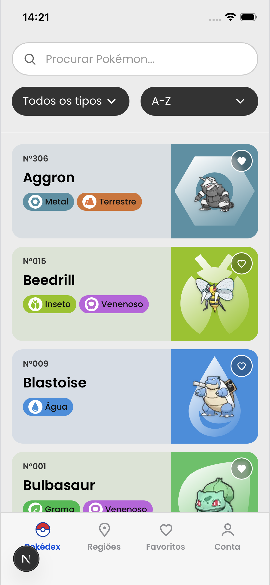
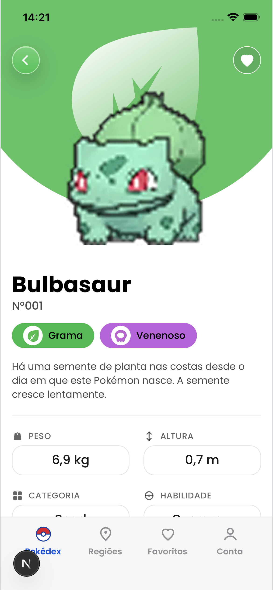
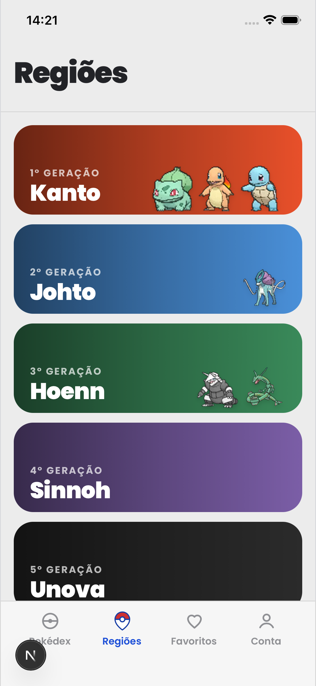
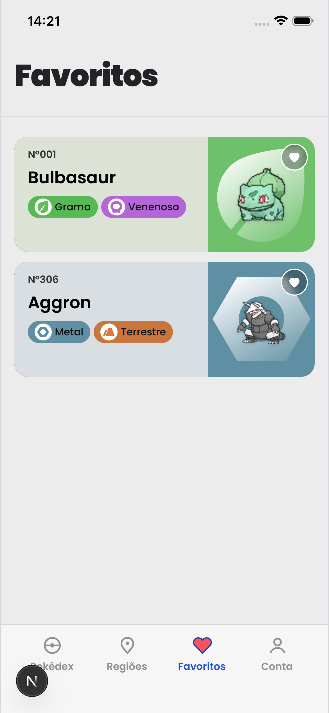
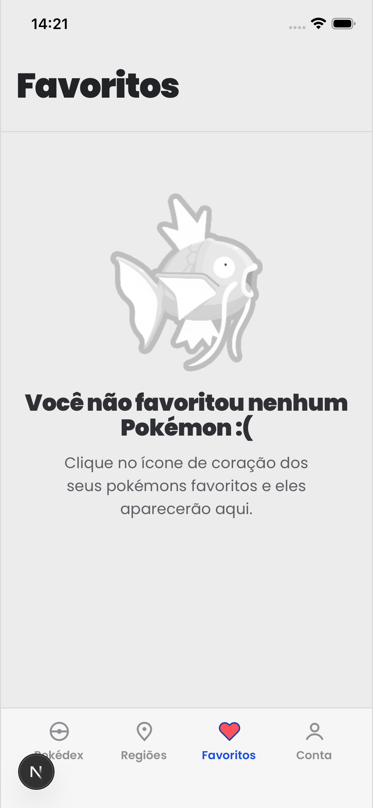
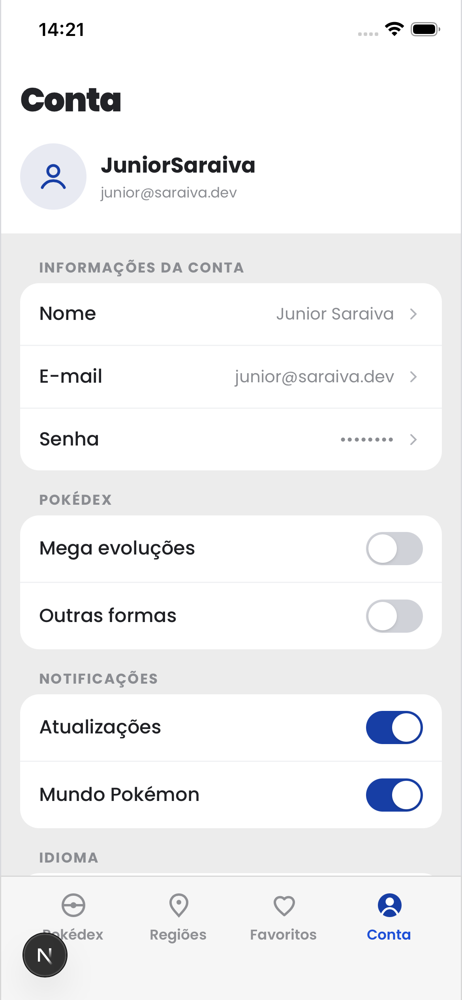

# Pokédex Mobile

Aplicativo mobile-first para explorar e gerenciar Pokémons, construído com Next.js App Router e React 19.

---

## Sobre o projeto

Pokédex Mobile é uma WebView/PWA que permite navegar pelo catálogo completo de Pokémons, explorar regiões, visualizar estatísticas detalhadas e gerenciar uma lista de favoritos personalizada. A interface foi projetada para uso mobile com navegação por tab bar, animações de swipe e suporte a Safe Areas.

---

## Design

O layout foi baseado no projeto da comunidade Figma:

**[Pokédex / Pokémon App — Junior Saraiva](https://www.figma.com/community/file/1202971127473077147)**

---

## Screenshots

<table>
    <tr>
        <th>Pokédex</th>
        <th>Detalhe</th>
        <th>Regiões</th>
    </tr>
    <tr>
        <td></td>
        <td></td>
        <td></td>
    </tr>
    <tr>
        <th>Favoritos</th>
        <th>Favoritos vazio</th>
        <th>Conta</th>
    </tr>
    <tr>
        <td></td>
        <td></td>
        <td></td>
    </tr>
</table>

---

## Funcionalidades

- **Splash screen** — tela de entrada com branding
- **Onboarding** — carrossel de introdução de 2 etapas
- **Login / Cadastro** — autenticação e criação de conta
- **Pokédex** — listagem com filtro por tipo e busca
- **Detalhes do Pokémon** — stats, evoluções, fraquezas e habilidades
- **Regiões** — navegação por região (Kanto, Hoenn, etc.) com Pokémons iniciais
- **Favoritos** — gerenciamento com swipe para deletar
- **Perfil** — visualização e configurações do usuário

---

## Stack

| Tecnologia | Versão |
|-----------|--------|
| [Next.js](https://nextjs.org) | 16.2.3 |
| [React](https://react.dev) | 19.2.4 |
| [Tailwind CSS](https://tailwindcss.com) | 4 |
| TypeScript | 5 |

---

## Estrutura de pastas

```
pokedex-next-app/
├── .agents/               # Agentes e skills do VS Code Copilot
│   ├── agents/            # Agentes customizados (feature-creator, test-writer)
│   └── skills/            # Skills instaladas (react-best-practices, etc.)
├── doc/
│   ├── images/            # Screenshots e assets de documentação
│   └── resources/         # Outros recursos de documentação
├── public/
│   └── assets/
│       ├── pokemon/       # Imagens dos Pokémons
│       └── types/         # Ícones dos tipos
└── src/
    ├── app/               # Rotas (App Router)
    │   ├── api/favorites/ # API REST de favoritos
    │   ├── pokedex/       # Listagem e detalhe
    │   ├── regions/       # Listagem e detalhe por região
    │   ├── favorites/
    │   ├── profile/
    │   ├── login/
    │   ├── register/
    │   ├── onboarding/
    │   └── splash/
    ├── components/        # Componentes compartilhados
    ├── data/mocks/        # Dados estáticos (JSON)
    ├── hooks/             # Hooks customizados
    └── lib/               # Serviços e utilitários
```

---

## Decisões de arquitetura

| Decisão | Implementação |
|---------|--------------|
| **Renderização** | Geração estática (`force-static`) em todas as páginas |
| **Dados** | Mock JSON em `src/data/mocks/` (catálogo, regiões, perfil, config) |
| **Favoritos** | `globalThis` Set no servidor + `/api/favorites` REST na sessão |
| **Mobile-first** | Viewport sem escala, Safe Areas, Apple WebApp meta |
| **Client / Server** | Server Components para conteúdo estático; `"use client"` para interatividade |

---

## Agentes de IA

A pasta `.agents/` contém configurações para o **GitHub Copilot** (VS Code):

### Agentes customizados (`agents/`)

| Agente | Descrição |
|--------|-----------|
| `feature-creator` | Cria features completas no padrão bulletproof-react |
| `test-writer` | Escreve testes unitários, de integração e E2E |
| `refactor-orchestrator` | Orquestra refatoração TypeScript incremental por fases |

### Skills instaladas (`skills/`)

| Skill | Descrição |
|-------|-----------|
| `react-best-practices` | Guia de performance React/Next.js |
| `composition-patterns` | Padrões de composição de componentes |
| `react-view-transitions` | Animações com a View Transition API (React 19) |
| `tailwind-4-docs` | Documentação e migração Tailwind CSS v4 |
| `create-component` | Criação de componentes compartilhados |
| `create-feature` | Criação de features completas |
| `conventional-commits` | Padrão de mensagens de commit |
| `web-design-guidelines` | Auditoria de UI/UX e acessibilidade |
| `write-tests` | Escrita de testes no padrão do projeto |
| `typescript-refactoring` | Workflow de refatoração incremental (tooling, type safety, arquitetura e testes) |

### Guias internos

- [TypeScript Style Guide](doc/typescript-style-guide.md)
- [Quality Scorecard](doc/quality-scorecard.md)

### Governança de PR

- Template de PR: [.github/PULL_REQUEST_TEMPLATE.md](.github/PULL_REQUEST_TEMPLATE.md)
- Pipeline de qualidade: [.github/workflows/quality.yml](.github/workflows/quality.yml)

---

## Como rodar

```bash
# Instalar dependências
npm install

# Servidor de desenvolvimento
npm run dev

# Build de produção
npm run build

# Iniciar em produção
npm start

# Lint
npm run lint

# Type-check
npm run type-check

# Verificação completa
npm run check
```

Abra [http://localhost:3000](http://localhost:3000) no navegador.

---

## Créditos

- **Design:** [Junior Saraiva — Pokédex / Pokémon App](https://www.figma.com/community/file/1202971127473077147) (Figma Community)
- **Pokémon e marcas registradas:** © Nintendo / Game Freak / The Pokémon Company
